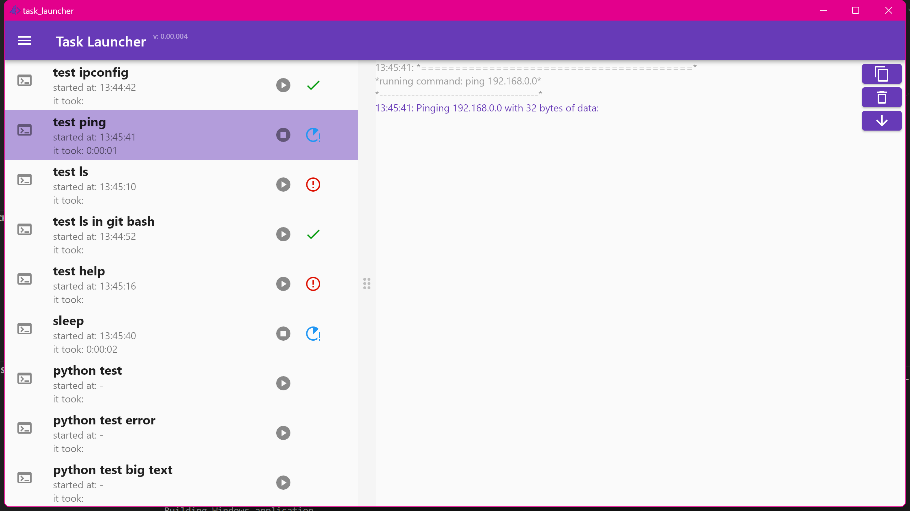

# task_launcher

A graphical task launcher written in flutter, setup via json file, support for different terminal apps, should run on windows linux macos (tested on windos).




## example

place a `setup.json` file next to the executable with e.g.
```json
{
    "profiles": [
        {
            "name": "git-bash",
            "executable": "C:/Program Files/Git/bin/bash.exe",
            "setup": [
                "export LANG=C.UTF-8"
            ]
        }
    ],
    "tasks": [
        {
            "name": "test ipconfig",
            "cmd": "ipconfig"
        },
        {
            "name": "test ping",
            "cmd": "ping",
            "params": [
                "192.168.0.0"
            ]
        },
        {
            "name": "test ls",
            "cmd": "ls"
        },
        {
            "name": "test ls in git bash",
            "profile": "git-bash",
            "cmd": "ls"
        },
        {
            "name": "test help",
            "cmd": "help"
        },
        {
            "name": "sleep",
            "profile": "git-bash",
            "cmd": "sleep 105"
        },
        {
            "name": "release",
            "profile": "git-bash",
            "cmd": "./scripts/release.sh"
        }
    ]
}
```